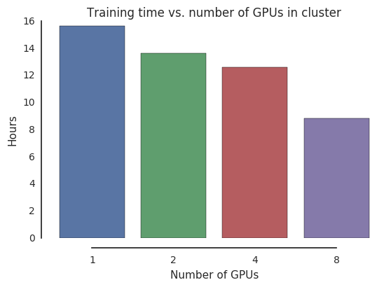
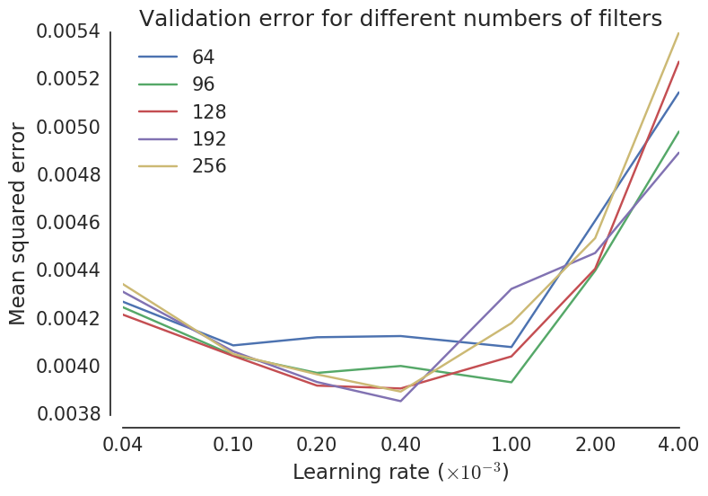

# Video Super-Resolution

## Preprocessing

We need to do some preprocessing before we can train our model.
If you want to download youtube videos, write one YouTube video ID on each line
(see `preprocessing/webcam.txt` for an example), and run
[generate_frames.py](preprocessing/generate_frames.py) in the `preprocessing` directory.

Once we have generated frames, we can use
[build_3d_image_data.py](preprocessing/build_3d_image_data.py)
to convert the video frames into a TFRecords format.
You can read more about getting data into TensorFlow
[here](https://www.tensorflow.org/programmers_guide/reading_data).
`build_3d_image_data.py` will take a pair of two adjacent frames
(1 previous frame, 1 current frame), and convert the frames into TFRecords.


## Training

Once we have the frames in TFRecords files, we can train the network.
To train on a single GPU, use `sres_train.py`.
If you have a multi-GPU cluster, you may want to use `sres_multi_train.py`
to train the network in a distributed fashion. For example,

```bash
python sres_multi_gpu_train.py \
  --num_gpus=4 \
  --data_dir=/home/paperspace/webcam \
  --train_dir=/home/paperspace/logs \
  --upscale_factor=4 \
  --batch_size=16 \
  --initial_learning_rate=0.0004 \
  --num_filters=32 \
  --first_filter_size=3 \
  --second_filter_size=3 \
  --third_filter_size=3
```



For more information, see TensorFlow tutorial on
[Training a Model Using Multiple GPU Cards](https://www.tensorflow.org/tutorials/deep_cnn#training_a_model_using_multiple_gpu_cards).

If your GPU cluster is using SLURM, you can use this
[job script](https://github.com/EdwardJKim/enhance/blob/master/tf.job)
for training and also for distributed
[hyperparamter optimization](https://github.com/EdwardJKim/enhance/blob/master/hypop.sh).



## Deploying

See
[https://github.com/EdwardJKim/enhance-webcam-demo](https://github.com/EdwardJKim/enhance-webcam-demo)
for an example of real-time webcam video super-resolution using Flask,
Javascript, and Tensorflow.


## References

[Real-Time Single Image and Video Super-Resolution Using an Efficient Sub-Pixel Convolutional Neural Network](https://arxiv.org/abs/1609.05158)

[Real-Time Video Super-Resolution with Spatio-Temporal Networks and Motion Compensation](https://arxiv.org/abs/1611.05250)

[https://github.com/Tetrachrome/subpixel](https://github.com/Tetrachrome/subpixel)

[TensorFlow's CIFAR-10 Tutorial](https://www.tensorflow.org/tutorials/deep_cnn)
